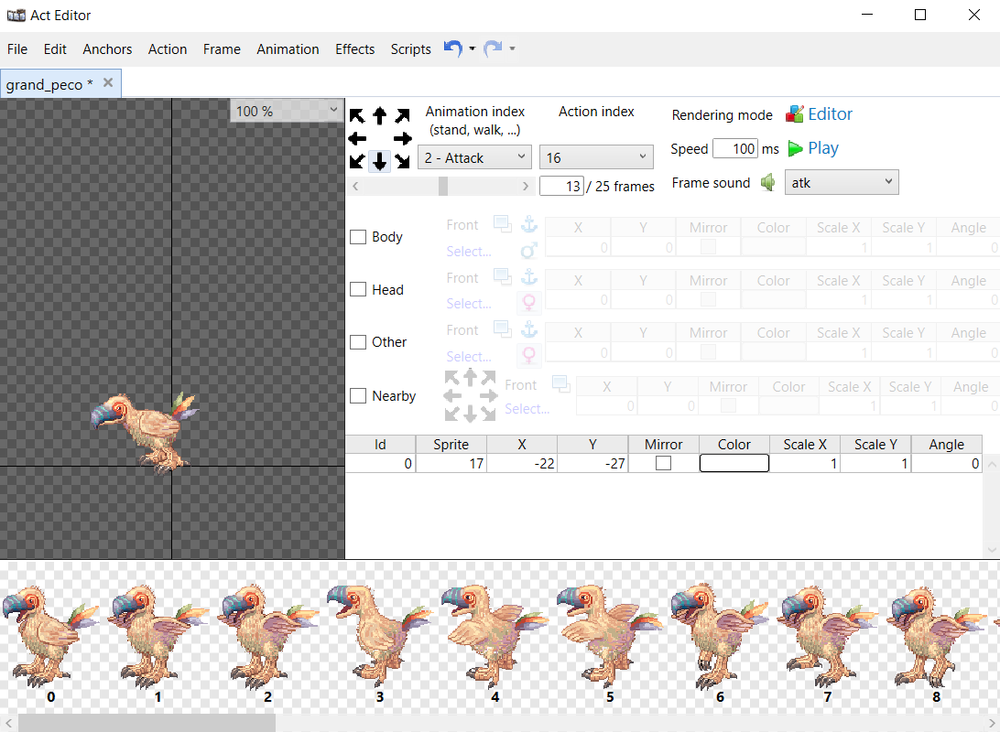

# Fixing act files attack delay

## What is this about?

In Ragnarok Online, when some monsters perform an attack, the damage number and the flinch animation in the target are displayed way out of sync (in some cases, even 5 seconds after the monster attacked).

This document will help you understand why does it happen and how to fix it. Use [ActEditor](https://github.com/Tokeiburu/ActEditor) to view and modify act files.

## The 'atk' event

Act files have events associated with them, which normally consists of wav files that are reproduced in a certain frame of each action. There's a special event called `atk`, which marks the frame that will produce both the damage number and the flinch animation in that specific frame:

However, some act files do not have this atk event in their attack sequences. In those cases, the client will wait until the last frame to display the damage and the flinch animation.

This is not a problem for the majority of act files with a total attack sequence time lower than the delay between attacks (Yoyo, Ghoul), but in some cases the attack is completely out of sync with the attack animation or the attack sequence is just too long (Grand peco, Dark illusion).

In those cases, all that's required is to assign the `atk` event (adding it to the events list if it's not there) to a suitable frame. In the case of the Grand Peco act file, frame at index 13 seems to be good enough:

> [!NOTE]
> The atk event must be added to all actions in the attack animation index (action index from 16 to 23, included)

Once done, save file and repack it into your GRF.

## WALKDELAY SYNC
> [!NOTE]
> Currently, only [Heracles](https://github.com/HeraclesHub/Heracles) supports WALKDELAY_SYNC with `DamageDelay`.

If your emulator uses WALKDELAY SYNC and you want to use these fixed act files, you must update the `DamageDelay` value in the `mob_db.conf` server file, for the monsters you fixed. For such, multiply the frame index with the `atk` event by the speed value in ActEditor. In the previous example of Grand Peco, that would be 13 * 100 = 1300.

